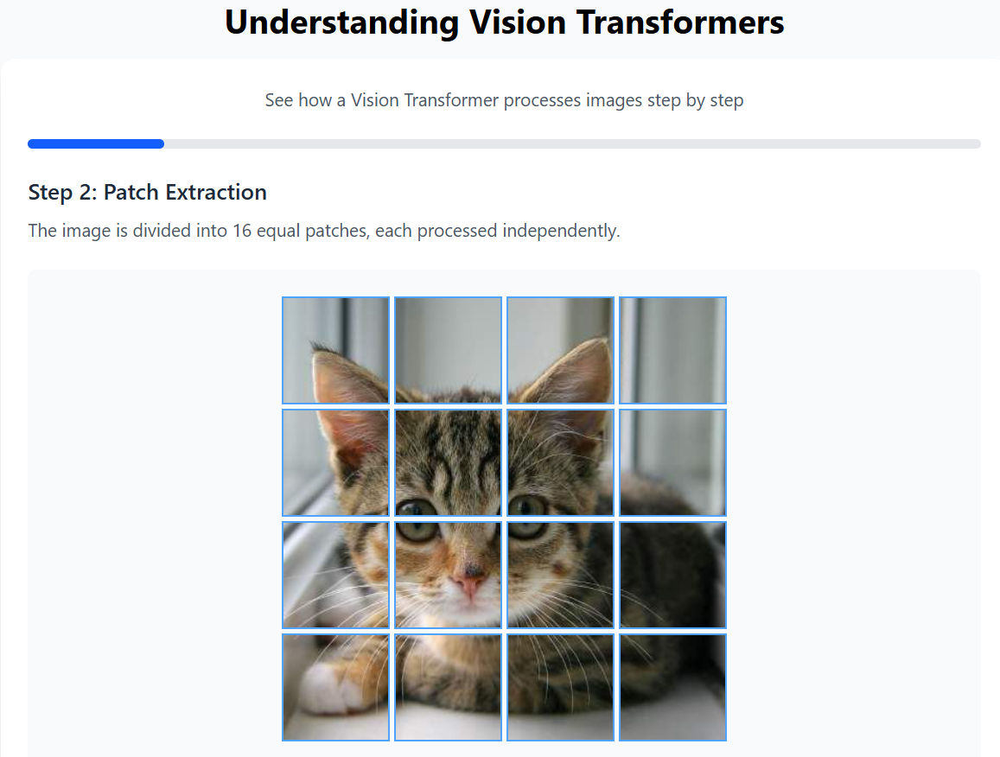

# Understanding Vision Transformers

## Interactive Demo

- Curious on how to use vision transformer in reality? check out this [HuggingFace link](https://huggingface.co/spaces/dionjin/LearnVisionTransformer) 
- Wondering how it actually works under the hood? I built [this website](https://vit.dylanjin.com) to explain ViT step by step

*How to use ViT through Python? check [this repo](https://github.com/Spec-DY/ViT-gradio-demo)*

## What is a Vision Transformer?

A Vision Transformer is a type of artificial intelligence system that can "see" and understand images. Imagine having a friend who has never seen a dog before, but after showing them pictures of different dogs, they can recognize new dogs they've never seen. Vision Transformers work similarly but with much more power and complexity.

## The Traditional Approach vs. Transformers

Before Vision Transformers, we used systems called Convolutional Neural Networks (CNNs) to analyze images:

- **CNNs**: Look at small parts of an image at a time (like focusing on ears, then nose, then tail) and gradually build up understanding.

- **Vision Transformers**: Look at the entire image all at once, seeing how different parts relate to each other simultaneously.

## How Vision Transformers Work

Let me break down how a Vision Transformer processes an image:

1. **Cutting the Image**: First, the Vision Transformer divides the image into small squares, like cutting a photo into a grid of puzzle pieces.

2. **Encoding Information**: Each puzzle piece gets converted into numbers that represent its colors, patterns, and features.

3. **Adding Position Information**: Since we've taken apart the image, we need to remember where each piece belongs - like numbering puzzle pieces.

4. **Attention Mechanism**: This is the magic part! The transformer asks: "How related is each piece to every other piece?" This helps it understand context. For example, when identifying a car, it sees that wheels, windows, and doors often appear together.

5. **Decision Making**: After analyzing all these relationships, the transformer makes a prediction about what's in the image.

## Real-World Applications

Vision Transformers are changing how we use technology:

- Medical imaging: Helping doctors identify diseases in X-rays and scans
- Self-driving cars: Helping vehicles recognize pedestrians, other cars, and road signs
- Content moderation: Identifying inappropriate images online
- Accessibility: Describing images for visually impaired people

## Advantages of Vision Transformers

- They can see relationships between distant parts of an image
- They require less human guidance about what features are important
- They scale extremely well with more data and computing power
- They can transfer learning between different types of images

## Interactive Demo

In our demo, you'll see how a Vision Transformer processes an image step by step:

1. We'll input a sample image
2. Watch how it gets divided into patches
3. Observe the attention patterns between different parts of the image
4. See the final prediction
